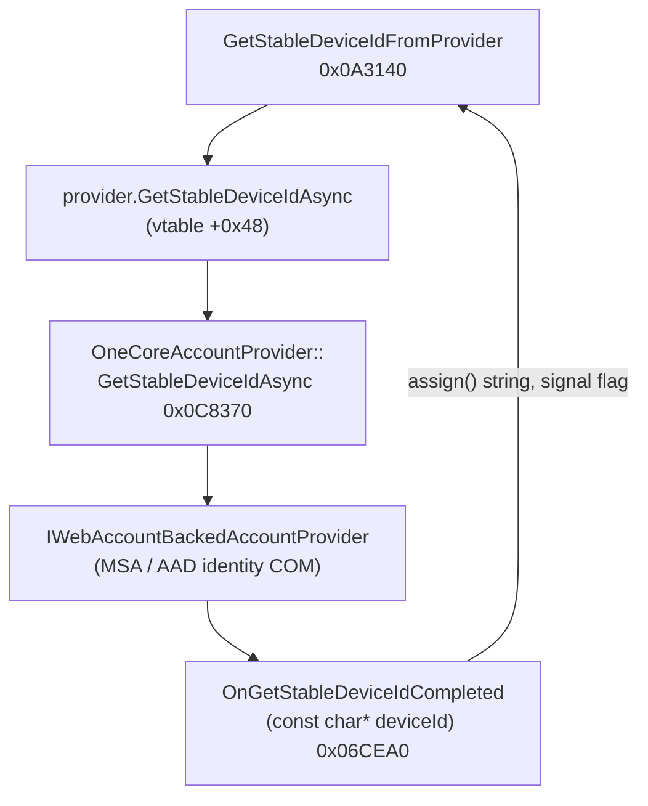
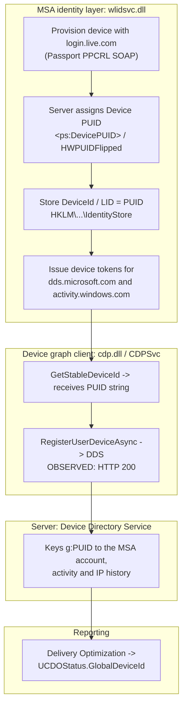

<div align="center">

# Full writeup of the Windows GDID

### Global Device Identifier fully reverse engineered
-8a2be2)
-0078d6)


*How Microsoft's "Global Device Identifier", the persistent Windows fingerprint named in the July 2026 Scattered Spider complaint, is actually generated, stored, and transmitted.*

</div>

---

## TL;DR

> [!NOTE]
> **Listed below is true, but missing some information. Regardless of being logged in with a MSN you WILL have a GDID. I didn't realize this at the time of posting but I looked into it. CDP has an anonymous device path that is used if no MSN has been connected.

- **GDID is a real telemetry item.** It shows up in the U.S. federal criminal complaint (*United States v. Peter Stokes*, N.D. Ill., July 2026) as `Global Device Identifier g:6755467234350028`.
- **It is a Microsoft Account "Device PUID".** A 64 bit Passport Unique ID assigned to a Windows installation when it registers with a Microsoft Account, written in the device graph as `g:<decimal>`.
- **The claims are wrong.** It is **not** "128 bit" and **not** "generated from serial numbers." The court record itself says a *reinstall produces a new GDID*, which rules out it being derived from hardware serials like your GPU.
- **The stack, bottom to top:** `wlidsvc` (Microsoft Account service) provisions the device with `login.live.com` and gets back a device PUID -> stores it in the registry -> the Connected Devices Platform (`cdp.dll` / `CDPSvc`) reads it and registers it into the **Device Directory Service (DDS)** graph -> Delivery Optimization reports it as the documented `UCDOStatus.GlobalDeviceId`.
- All of it was reproduced on a live Windows 11 (26200) machine with public symbols. **You can find your own GDID in one registry read** ([§7](#7-find-your-own-gdid)).

> [!NOTE]
> **Confidence labelling.** Every claim is tagged so you can weigh each one yourself: `[COURT]` primary source fact, `[OBSERVED]` reproduced live on my test machine, `[STATIC]` proven from binaries and public Windows PDBs, `[ASSESSED]` strong inference from the evidence.

---

## Contents

1. [Background: what the court actually said](#1-background-what-the-court-actually-said)
2. [Debunking the viral myths](#2-debunking-the-viral-narrative)
3. [Where GDID surfaces: Delivery Optimization](#3-where-gdid-surfaces-delivery-optimization)
4. [Who owns it: Connected Devices Platform to DDS](#4-who-owns-it-the-connected-devices-platform-to-dds)
5. [How CDP gets it: it consumes, it does not compute](#5-how-cdp-gets-it-it-consumes-it-does-not-compute)
6. [The mint: MSA Device PUID (`wlidsvc`)](#6-the-mint-msa-device-puid-wlidsvc)
7. [Find your own GDID](#7-find-your-own-gdid)
8. [Reducing the exposure](#8-reducing-the-exposure)
9. [Methodology (reproducible)](#9-methodology-reproducible)
10. [Limitations and honest caveats](#10-limitations--honest-caveats)

---

## 1. Background: what the court actually said

On July 1, 2026 the DOJ unsealed a criminal complaint against Peter Stokes, an alleged member of *Scattered Spider* (a.k.a. Octo Tempest / UNC3944 / 0ktapus). The affidavit describes how Microsoft helped the FBI attribute activity to a device.

> [!IMPORTANT]
> **`[COURT]`** From the superseding complaint (¶25, p.34), verbatim:
>
> *"the ngrok account was set up through **Global Device Identifier g:6755467234350028** ('the GDID'). According to a Microsoft representative, a Global Device Identifier in the Windows ecosystem is a **persistent, device level identifier designed to uniquely identify an installation of a Windows operating system** on a device... A GDID is a globally unique identifier tied to the **installation** of Windows on a device. A GDID remains consistent across Windows operating system updates on a device, but a **reinstall of Windows... will be tied to a new unique GDID.**"*

A footnote adds that one Microsoft user can have multiple GDIDs. The affidavit then correlates the GDID's IP history and browsing (e.g. `empirehotelnyc.com`, a Growtopia/Ubisoft login URL) with the accounts the suspect was logged into.

Two things here carry the rest of this writeup:

1. The value is **`g:` plus a decimal integer** (`g:6755467234350028`). In hex that is `0x0018000FC8CB93CC`, so a **64 bit** number.
2. **A reinstall gives a new GDID.** So it can't just be a function of unchanging hardware.

---

## 2. Debunking the viral narrative

The social media summary claimed the GDID is *"a 128 bit identifier generated from serial numbers on install."* **Both halves are false:**

| Claim (social media) | Reality (primary source) |
|---|---|
| "128 bit" | The value in the complaint is `g:6755467234350028`, a decimal that fits in **64 bits** (`0x0018000FC8CB93CC`). |
| "generated from serial numbers on install" | The complaint says a **reinstall produces a new GDID**. A value derived from fixed serials would come back the same after a reinstall, not change. |

> [!NOTE]
> **After some more reversing of CDP. I provided some misinfo. Using a local account does not prevent a GDID. CDP has an anonymous device path that is taken if no microsoft account. Keep this in mind when reading.**

---

## 3. Where GDID surfaces: Delivery Optimization

**`[STATIC]`** Microsoft's public Azure Monitor docs define a `GlobalDeviceId` column in the **`UCDOStatus`** (Update Compliance / Delivery Optimization) table:

> `GlobalDeviceId` (string): *"Microsoft global device identifier. This is an identifier used by Microsoft internally."*

It sits right next to `LastCensusSeenTime`, `ISP`, `City`, `Country`, so a device id lined up with geo and IP. This is the one place Microsoft names the value in public docs. But Delivery Optimization only **reports** it. Importantly it does NOT own it. Follow it upstream and you land on the Connected Devices Platform.

---

## 4. Who owns it: the Connected Devices Platform to DDS

**`[STATIC]`** `C:\Windows\System32\cdp.dll` (the Connected Devices Platform, services `CDPSvc` + `CDPUserSvc`) contains the `GlobalDeviceId` symbol and an entire **Device Directory Service** registration subsystem:

```
ddsregistrationclient.cpp   ddsregistrationmanager.cpp   ddsregistrationinfo.cpp
DdsRegistrationClient   RegisterUserDevicesObserver   DdsRegistrationInfoProviderForCDP
endpoints: dds.microsoft.com  fd.dds.microsoft.com  aad.cs.dds.microsoft.com  cdpcs.access.microsoft.com
device-id format string: "g:%s"
```

**DDS = Device Directory Service**, Microsoft's cross device identity graph (the backend behind Phone Link, cloud clipboard, "Continue on PC", Nearby Share). CDP is the Windows client that **registers the installation into that graph**, where it gets keyed as `g:<decimal>`.

### 4.1 Captured live

**`[OBSERVED]`** Forcing a fresh registration (restart `CDPSvc` with its local state cleared) and capturing CDP's own ETW providers produced the whole handshake:

```text
DdsClient::RegisterUserDeviceAsync()   RegistrationReason: Startup   Account Type: MSA
DDSClient: Registration response received. HTTP status code: 200
OnRegisterUserDeviceComplete
GetDeviceIdAndTicketActivity -> deviceid: 0018XXXXXXXXXXXX
```

That `deviceid`, written as `g:<decimal>`, matches the complaint's value structurally:

| | value | hex (64 bit) | class prefix |
|---|---|---|:---:|
| **My machine (redacted)** | `g:XXXXXXXXXXXXXXXX` | `0x0018XXXXXXXXXXXX` | `0018` |
| **Court exhibit** | `g:6755467234350028` | `0x0018000FC8CB93CC` | `0018` |

Both are 64 bit values in the same `0x0018` high word class (the device PUID namespace, see [§6](#6-the-mint-msa-device-puid-wlidsvc)). The `g:` prefix is just that integer in decimal.

---

## 5. How CDP gets it: it consumes, it does not compute

**`[STATIC]`** With the public PDB (`cdp.pdb`), the device id path in `cdp.dll` is just a request and wait against the identity stack. CDP never computes the id itself:



The callback that receives it makes it obvious. The id shows up as a **string** and just gets stored:

```asm
; OnGetStableDeviceIdCompleted
mov  rbp, r9                 ; r9 = device-id STRING handed in by the identity provider
lea  rcx, [rsi+0xD8]         ; CDP member field
mov  rdx, rbp
call assign@basic_string     ; store it, no computation, no serials
call Set@CdpWaitableFlag      ; unblock the waiter
```

**Bottom line:** the GDID is minted below CDP, down in the Windows identity stack, and handed to CDP as an opaque string. That points at the Microsoft Account service.

---

## 6. The mint: MSA Device PUID (`wlidsvc`)

**`[STATIC]`** `C:\Windows\System32\wlidsvc.dll`, the **Microsoft Account / Passport (Windows Live ID) service**, is the only identity binary that contains the literal `GlobalDeviceId`, and it holds the full device provisioning machinery:

```
CDeviceIdentityBase::CreateNewDeviceIdentity / Provision / BindDeviceToHardware / GetDeviceCert
DeviceAssociateRequest      (Passport PPCRL SOAP -> login.live.com)
<ps:DevicePUID> ... </ps:DevicePUID>
DeviceIdStore::LogToRegistry
BCryptGenRandom / CCryptRandom::GenRandom     (device KEY, not the id)
```

The identifier is a **Device PUID** (Passport Unique ID), a 64 bit MSA identifier. The `BCryptGenRandom` in there makes the device *authentication key* that `BindDeviceToHardware` pins to the machine, **not** the PUID.

### 6.1 It is server assigned

**`[STATIC]`** The client pulls the PUID out of the **server's SOAP response**, with an XPath into the response body:

```
/S:Envelope/S:Body/ps:DeviceUpdatePropertiesResponse/HWPUIDFlipped
```

`CAssociateDeviceRequest::ParseResponseBody` and the related `ParseResponse` methods read response XML nodes into BSTRs. So the flow is: **client provisions the device -> `login.live.com` assigns and returns the device PUID -> client stores it.** That is exactly why a reinstall produces a *new* GDID (new provisioning, new server assigned PUID), and why it is not a hardware hash.

### 6.2 It is persisted in cleartext

**`[OBSERVED]`** The Microsoft Account identity store keeps the value right in the registry, in your own user hive:

```
HKCU\SOFTWARE\Microsoft\IdentityCRL\ExtendedProperties
    LID = 0018XXXXXXXXXXXX

HKCU\SOFTWARE\Microsoft\IdentityCRL\Immersive\production\Token\{...}
    DeviceId = 0018XXXXXXXXXXXX
```

Byte for byte the same value CDP registered into DDS live. Your user account PUID is a different number stored elsewhere as `puid = 0003...` (e.g. `00034002XXXXXXXX`). There's also an HKLM cache key named after the PUID (`HKLM\SOFTWARE\Microsoft\IdentityCRL\NegativeCache\<PUID>_<userSID>`), but that one is SYSTEM only, so you read the value out of HKCU.

> [!NOTE]
> **The prefix tells you what it is.** User PUIDs are `0003` class, **device** PUIDs are `0018` class. The court's GDID (`0018000FC8CB93CC`) is in the `0018` device PUID space, same as mine.

### 6.3 It authenticates the graph endpoints

**`[OBSERVED]`** The MSA token cache (`HKLM\SOFTWARE\Microsoft\IdentityCRL\NegativeCache\...`) has device tokens scoped to exactly the endpoints CDP uses:

```
scope=service::dds.microsoft.com::MBI_SSL_TOKEN_BROKER
scope=service::activity.windows.com::MBI_SSL_SA_TOKEN_BROKER
```

So the Microsoft Account service hands out the device credentials that authenticate the DDS registration and the activity uploads that carry the GDID.

### 6.4 The complete chain



Everything the complaint pins on "the GDID", persistent per install, survives updates, new on reinstall, tied to a Microsoft Account, trackable across IPs and browsing, all of it falls out of this being a **server assigned MSA Device PUID that CDP registers into the device graph.**

---

## 7. Find your own GDID

**`[OBSERVED]`** On a machine signed into a Microsoft Account, one registry read from your own user hive, no admin needed:

```powershell
(Get-ItemProperty 'HKCU:\SOFTWARE\Microsoft\IdentityCRL\ExtendedProperties').LID
```

That gives you your device PUID as 16 hex digits (e.g. `0018XXXXXXXXXXXX`). To see it in the `g:<decimal>` form the way it shows up server side:

```powershell
$hex = (Get-ItemProperty 'HKCU:\SOFTWARE\Microsoft\IdentityCRL\ExtendedProperties').LID
"g:$([Convert]::ToUInt64($hex,16))"
```

If `ExtendedProperties\LID` is empty on your box, the same value is sitting under `HKCU\SOFTWARE\Microsoft\IdentityCRL\Immersive\production\Token\{...}\DeviceId`.

> [!WARNING]
> **Do not post your own value.** Your device PUID, your MSA CID (`0003...`), and your user SID all deanonymize you. Redact them in any public writeup. The only value that's safe to quote is the court's, because it's already public.

---

## 8. Reducing the exposure

The GDID exists because your device is registered into the Microsoft Account device graph and the Connected Devices Platform keeps it synced. To cut it back:

- **Kill the Connected Devices Platform** (`CDPSvc`, `CDPUserSvc`) and turn off **Activity History** (Settings, Privacy, Activity history) to stop the graph sync and the activity uploads.
- Deleting `%LOCALAPPDATA%\ConnectedDevicesPlatform` only wipes local CDP state. The PUID comes right back from the identity store, so that alone won't cut it.
- A **reinstall** gives you a new GDID (the complaint says so), but it gets tied to a fresh one the second it registers again.

---

## 9. Methodology (reproducible)

All of this came off a stock Windows 11 (build 26200) machine.
- **Live capture:** CDP's TraceLogging ETW providers (`Microsoft.Windows.CDP.*`) via `logman` while forcing a fresh `CDPSvc` registration, decoded with `tracerpt`.
- **Registry and token cache:** `IdentityStore` and `IdentityCRL` under `HKLM\SOFTWARE\Microsoft`.

ETW and static analysis is what actually worked. A proxy will just waste your time.

<details>
<summary><b>Appendix: CDP ETW provider GUIDs</b> (click to expand)</summary>

Computed with the EventSource name hash (SHA1 of the namespace plus the UTF-16BE uppercased provider name). Verify it against the known `System.Runtime` value `49592c0f-5a05-516d-aa4b-a64e02026c89`:

```
Microsoft.Windows.CDP.Core                    {7762de0c-b0a6-571a-68d3-c018bf009496}
Microsoft.Windows.CDP.Core.Error              {a1ea5efc-402e-5285-3898-22a5acce1b76}
Microsoft.Windows.CDP.CDS                     {dfa6e32a-095f-5f57-d025-0887d33507a1}
Microsoft.Windows.CDP.Aggr                    {bc1826c8-369c-5b0b-4cd1-3c6ae5bfe2e7}
Microsoft.Windows.CDP.AFS                     {5fe36556-c4cd-509a-8c3e-2a547ea568ae}
Microsoft.Windows.CDP.OnecoreAccountProvider  {4ee5bf9a-3e8f-540b-8bfb-12457a2854b6}
Microsoft.Windows.CDP                          {9f4cc6dc-1bab-5772-0c71-a89954718d66}
```

</details>

<details>
<summary><b>Appendix: key binaries and symbols</b> (click to expand)</summary>

| Binary | Role | Notable symbols |
|---|---|---|
| `wlidsvc.dll` | Microsoft Account / Passport service, **mints** the Device PUID | `CDeviceIdentityBase::CreateNewDeviceIdentity`, `CAssociateDeviceRequest::ParseResponseBody`, `DeviceIdStore::LogToRegistry` |
| `cdp.dll` | Connected Devices Platform, **registers** PUID into DDS | `DdsRegistrationClient`, `GetStableDeviceIdFromProvider` (0x0A3140), `OnGetStableDeviceIdCompleted` (0x06CEA0) |
| `dosvc.dll` / DO | Reports the id as `UCDOStatus.GlobalDeviceId` | n/a |

Registry: `HKLM\SOFTWARE\Microsoft\IdentityStore` (`DeviceId` and `LID`), `HKLM\SOFTWARE\Microsoft\IdentityCRL\NegativeCache` (token scopes).

</details>

> [!NOTE]
> NullZeroX on twitter has told me that GDID is also sent regardless of being logged in with a ms account on your device. I'm not sure how true it is, but worth taking note.

---

<div align="center">

*Firsthand analysis. Corrections welcome. Also thanks claude for helping with this writeup and the diagrams :3*


</div>
